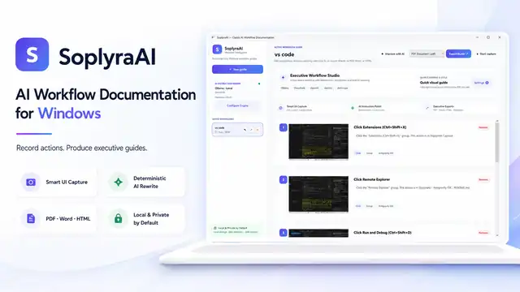
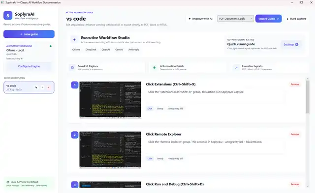
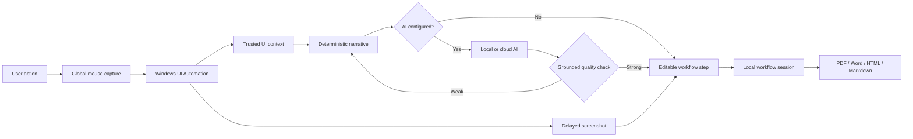

<p align="center">
  
</p>

<h1 align="center">SoplyraAI</h1>
<p align="center"><strong>AI Workflow Documentation for Windows</strong></p>
<p align="center">
  Record real work. Understand every meaningful action. Produce executive-ready guides in minutes.
</p>

<p align="center">
  
  
  
  
  
  
</p>

<p align="center">
  
</p>

> **SoplyraAI turns live Windows workflows into structured documentation while you work.** It captures meaningful UI actions, records the screen state, understands available Windows UI Automation context, improves wording with local or cloud AI when useful, and exports a professional guide without requiring a separate documentation pass.

---

## Executive overview

Process knowledge is usually trapped in people, meetings, videos, screenshots, and outdated SOPs. SoplyraAI converts that operational knowledge into a reusable asset at the moment the work happens.

**The product loop is intentionally simple:**

`Start capture → perform the task → review the generated steps → improve with AI → export the guide`

SoplyraAI is built for teams that need documentation to be **fast, repeatable, private, editable, and shareable**.

### Current Windows Studio

<p align="center">
  
</p>

The current studio provides saved workflows, screenshot-backed steps, AI instruction polishing, provider configuration, deterministic descriptions, per-step editing/removal, and direct export from one Windows-native workspace.

---

## What SoplyraAI delivers

| Capability | Product value |
|---|---|
| **Smart UI Capture** | Captures meaningful mouse actions across Windows applications and inspects the control at the click location. |
| **Screenshot-backed steps** | Every recorded action can retain visual evidence of the exact application state. |
| **Action understanding** | Uses Windows UI Automation metadata such as control name, type, application, window, process, and click position when available. |
| **Grounded descriptions** | Deterministic logic creates a useful baseline even when no AI model is configured. |
| **AI instruction polish** | Local or cloud models can improve wording, but weak/generic model output is rejected in favor of the stronger grounded description. |
| **Two documentation modes** | Quick Visual Guide for concise instructions; Detailed SOP for purpose, expected result, and richer context. |
| **Saved workflows** | Rename, reopen, edit, remove individual captures, or delete a complete workflow. |
| **Executive exports** | Native PDF plus Word `.docx`, HTML, and Markdown output with screenshots and structured instructions. |
| **Local-first security** | Screenshots and sessions stay local by default; typed characters are not recorded; password fields are protected. |
| **Windows distribution** | Self-contained Windows x64 EXE plus an Inno Setup installer. |

---

## From click to executive guide



The important architectural choice is that **AI improves documentation; it does not control whether documentation can be produced**. SoplyraAI stays useful offline with deterministic descriptions and local export.

---

## AI engine: local-first, provider-flexible

SoplyraAI can run with no AI at all, with a local Ollama model, or with a configured cloud provider.

### Supported provider paths

| Mode | Providers / examples | Best use |
|---|---|---|
| **Local** | Ollama | Privacy-first documentation, local reasoning, optional local vision |
| **Cloud** | OpenAI | General instruction and multimodal workflows |
| **Cloud** | DeepSeek | Reasoning-oriented documentation |
| **Cloud** | NVIDIA NIM | Hosted model access through NVIDIA endpoints |
| **Cloud** | Gemini | Multimodal / vision-capable workflows |
| **Cloud** | Anthropic | High-quality instruction rewriting and reasoning |

SoplyraAI sends compact context to a model only when AI enhancement is enabled. Remote screenshot analysis is an explicit opt-in path; local-first remains the default.

### Model output is not blindly trusted

A workflow recorder should not replace a grounded instruction with generic text such as *“this activates the selected control.”* SoplyraAI therefore evaluates model output before accepting it. If the response is vague, uncertain, ungrounded, or merely repeats the click, the deterministic description remains in place.

---

## Documentation output

A captured workflow can be exported as:

- **PDF** — generated natively by SoplyraAI without requiring Edge, Chrome, Word, a printer driver, or an external PDF application.
- **Word `.docx`** — structured document with embedded captured screenshots.
- **HTML** — self-contained shareable web document.
- **Markdown** — portable documentation with an accompanying images folder.

Exported files inherit the saved workflow title. A workflow named `GitHub Flow` exports as `GitHub Flow.pdf`, `GitHub Flow.docx`, `GitHub Flow.html`, and `GitHub Flow.md`.

### Step structure

```text
Workflow name
Step number + action title
Captured screenshot
How to perform
What this does
Expected result
Application / control / window context
```

This makes the output useful for SOPs, onboarding, QA evidence, support playbooks, client handover, internal controls, and training material.

---

## Privacy and security model

SoplyraAI is designed around a local-first trust boundary:

- no account required for local operation,
- local workflow/session storage,
- no keyboard logger,
- typed characters are not persisted,
- password-field screenshots are protected,
- API keys are protected with Windows DPAPI,
- remote AI is explicit and HTTPS-constrained,
- screenshots are never silently redirected to a different AI host,
- session and screenshot paths are validated before reads/exports/deletion,
- the floating recording controller is excluded from captured screenshots when Windows supports it,
- GitHub CI includes CodeQL, dependency vulnerability gates, self-tests, and pinned action revisions.

See [`docs/PRIVACY.md`](docs/PRIVACY.md) and [`SECURITY.md`](SECURITY.md).

---

## Build SoplyraAI on Windows

### Requirements

- Windows 10 or Windows 11 x64
- .NET 8 SDK
- Optional: Inno Setup 6 for a local installer build

### Clone and run

```powershell
git clone https://github.com/logeshv586-code/SoplyraAI.git
cd SoplyraAI
dotnet restore
dotnet run --project .\src\SoplyraAI.App\SoplyraAI.App.csproj
```

### Build the self-contained EXE

```powershell
.\build-exe.ps1
```

Output:

```text
dist\win-x64\SoplyraAI.exe
```

### Build the installer

```powershell
& "C:\Program Files (x86)\Inno Setup 6\ISCC.exe" .\installer.iss
```

Output:

```text
dist\SoplyraAI-Setup.exe
```

The Windows EXE and installer use the same SoplyraAI application identity and icon contained in the repository.

---

## CI and release confidence

The Windows workflow validates the actual packaged application rather than stopping at compilation:

```text
Restore
  ↓
Dependency vulnerability check
  ↓
Release build
  ↓
Self-contained win-x64 publish
  ↓
SoplyraAI.exe --self-test
  ↓
Inno Setup installer
  ↓
SHA-256 checksums
  ↓
Windows artifact
```

The self-test covers critical behavior such as structured export content, native PDF generation, workflow naming, description normalization, remove/delete persistence, and security boundaries.

---

## Repository map

```text
SoplyraAI/
├─ src/SoplyraAI.App/
│  ├─ Assets/
│  │  └─ SoplyraAI.ico
│  ├─ Models/
│  ├─ Services/
│  ├─ Views/
│  ├─ MainWindow.xaml
│  └─ SoplyraAI.App.csproj
├─ docs/
│  ├─ images/
│  │  ├─ soplyraai-logo.webp
│  │  ├─ soplyraai-hero.webp
│  │  └─ soplyraai-app.webp
│  ├─ PRIVACY.md
│  └─ RESEARCH.md
├─ .github/workflows/
├─ build-exe.ps1
├─ install-local-ai.ps1
├─ installer.iss
├─ SECURITY.md
└─ SoplyraAI.sln
```

---

## Product direction

SoplyraAI is intended to become a **workflow intelligence layer**, not only a screenshot recorder. The same captured procedure can evolve into training material, reusable execution knowledge, compliance evidence, agent-ready procedures, and change-aware operational documentation.

### Roadmap

- [ ] Drag/drop and file-selection understanding
- [ ] Manual crop, blur, arrow, box, and text annotation tools
- [ ] OCR-assisted sensitive-data redaction
- [ ] Browser URL/page-context capture where safe and useful
- [ ] Duplicate/noise-step merging
- [ ] Organization templates and branded exports
- [ ] Interactive “Guide me” replay
- [ ] Semantic search across saved workflows
- [ ] Workflow drift/change detection
- [ ] Team/self-hosted synchronization
- [ ] Agent-ready reusable procedure generation

---

## Research lineage

SoplyraAI is an independent implementation informed by public workflow-documentation product patterns and open-source research, including Scribe-style capture concepts, `aws-samples/sample-scribe-ai`, OpenSteps, Mimik, and Microsoft Skill Recorder.

The project does not depend on those products as its recorder core, and SoplyraAI is not affiliated with or endorsed by Scribe or the referenced projects. See [`docs/RESEARCH.md`](docs/RESEARCH.md) for the design comparison.

---

## Contributing and security

Contributions are welcome in Windows capture reliability, UI Automation edge cases, export quality, accessibility, local-model integration, security, and product UX.

- Read [`CONTRIBUTING.md`](CONTRIBUTING.md) before opening a pull request.
- Report sensitive vulnerabilities through the process in [`SECURITY.md`](SECURITY.md), not a public issue.

---

## License

MIT. See [`LICENSE`](LICENSE).

<p align="center">
  
</p>
<p align="center">
  <strong>SoplyraAI</strong><br/>
  <sub>Record actions. Preserve operational knowledge. Produce executive guides.</sub>
</p>
