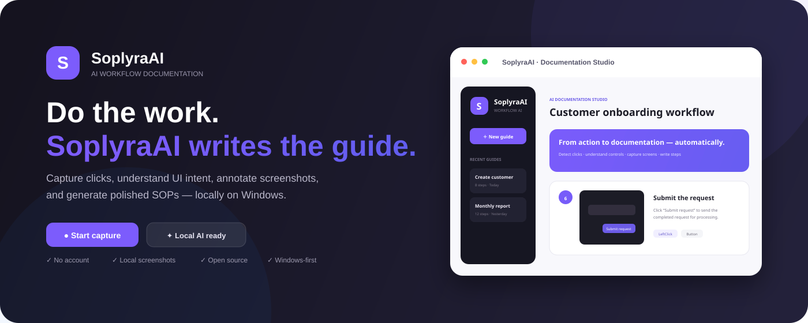
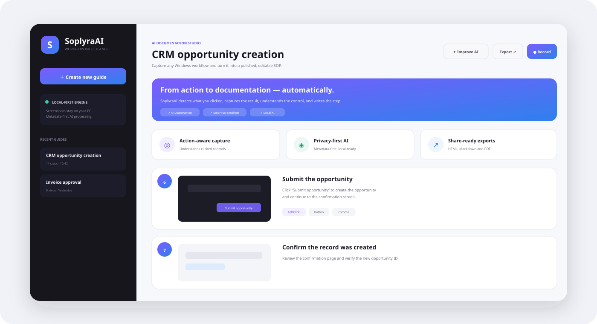
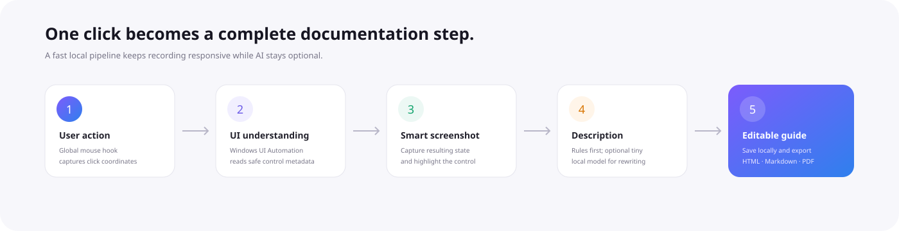
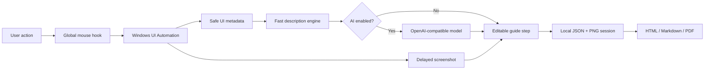
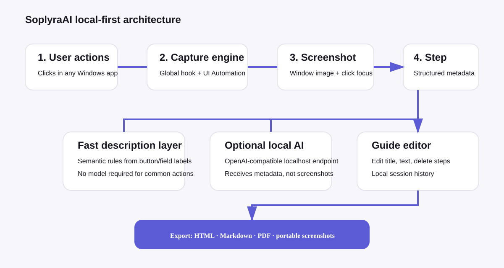

<p align="center">
  
</p>

<h1 align="center">SoplyraAI</h1>
<p align="center"><strong>Do the work. SoplyraAI writes the guide.</strong></p>
<p align="center">
  A Windows-first, local-first AI workflow recorder that turns real desktop actions into polished step-by-step documentation, SOPs, onboarding guides, QA instructions, and support walkthroughs.
</p>

<p align="center">
  
  
  
  
  
</p>

> **Project status:** early-stage open-source Windows application. The capture, description, local session, export, self-test, installer, and CI architecture are implemented; the project is being hardened toward a stable public release.

---

## Why SoplyraAI exists

Most process documentation starts **after** the work is already finished. Someone has to recreate the task, take screenshots, crop them, number them, explain every button, format the document, and keep it updated.

SoplyraAI changes that workflow:

**record once → perform the task normally → receive an editable guide.**

Instead of treating screen recording as a video problem, SoplyraAI treats it as a **structured workflow-understanding problem**. It combines Windows event capture, UI Automation metadata, smart screenshots, deterministic descriptions, and an optional lightweight AI rewrite layer.

<p align="center">
  
</p>

## The product in one minute

1. Open **SoplyraAI**.
2. Name the guide.
3. Click **Start capture**.
4. Use any Windows application normally.
5. SoplyraAI records meaningful clicks and understands the UI control under the pointer.
6. Each action becomes a step with a screenshot, contextual metadata, and a plain-language instruction.
7. Stop recording and edit anything you want.
8. Optionally improve wording with a small local/OpenAI-compatible model.
9. Export the finished guide to **HTML, Markdown, and PDF**.

<p align="center">
  
</p>

---

## What makes SoplyraAI different

### 🧠 Understand actions, not just pixels
SoplyraAI uses **Windows UI Automation** to read control labels, types, window information, process context, and safe accessibility metadata. A click on a control can be understood as something like:

```text
Action: LeftClick
Control: Button
Name: Submit request
Window: Customer Portal
Process: chrome
```

That context is much cheaper and faster to reason about than sending every screenshot to a vision model.

### 📸 Automatic visual evidence
Every meaningful action can produce a screenshot of the resulting application state with the relevant click/control highlighted. The screenshot becomes part of the editable guide immediately.

### ⚡ AI is an accelerator, not a dependency
Common actions such as **Save, Submit, Add, Delete, Search, Upload, Download, Next, Back, Edit, Settings, and Sign in** are described instantly without an LLM.

When AI enhancement is enabled, SoplyraAI sends compact structured context to an **OpenAI-compatible endpoint** for cleaner wording. The default local model path is intentionally small so documentation generation stays responsive.

### 🔒 Local-first by design
The default architecture is deliberately privacy-oriented:

- no account required,
- sessions stored locally,
- screenshots stay on the machine by default,
- typed characters are not stored,
- detected password fields are masked,
- AI enhancement is optional,
- local OpenAI-compatible endpoints are supported.

See [`docs/PRIVACY.md`](docs/PRIVACY.md).

### ✨ Built for professional output
The editor is designed for documentation that can be reviewed and shared, not just a raw event log. Users can rename a guide, edit titles/descriptions, remove irrelevant steps, and export a portable package.

---

## Current feature set

| Area | Capability |
|---|---|
| Capture | Global left/right/middle mouse actions across Windows apps |
| Context | Windows UI Automation metadata at click coordinates |
| Screenshots | Active-window or full-desktop capture |
| Annotation | Click/control highlighting |
| Description | Fast deterministic step wording |
| AI | Optional OpenAI-compatible local/remote rewrite |
| Privacy | Local sessions, password masking, no typed-character storage |
| Editing | Rename guides, edit step titles/descriptions, delete steps |
| Storage | Reopen locally saved sessions |
| Export | HTML, Markdown, PDF |
| Distribution | Self-contained Windows x64 executable |
| Installer | Inno Setup installer |
| Validation | Built-in `--self-test` run against the published EXE |
| CI | GitHub Actions Windows build and artifact publication |

---

## Architecture



The architecture intentionally separates **capture**, **understanding**, **description**, **storage**, and **export**. This keeps the recorder useful even when no model is installed.

<p align="center">
  
</p>

---

## Premium desktop experience

The Windows application includes:

- dark premium navigation with recent guides,
- a dedicated AI Documentation Studio workspace,
- visible local-first/privacy state,
- one-click recording,
- floating pause/stop capture controls,
- AI and capture configuration,
- rich step cards with screenshots and action metadata,
- editable generated instructions,
- direct export workflow.

The UI is WPF/.NET 8 and intentionally Windows-native so it can integrate with desktop-level hooks and UI Automation directly.

---

## Local AI setup

The recommended lightweight default is:

```text
qwen2.5:0.5b
```

with an Ollama OpenAI-compatible endpoint:

```text
http://127.0.0.1:11434/v1
```

Inside the application, open **AI & capture settings → Set up local AI**. SoplyraAI will attempt to:

1. detect Ollama,
2. install it through `winget` when needed,
3. pull `qwen2.5:0.5b`,
4. configure the local endpoint.

Or run:

```powershell
.\install-local-ai.ps1
```

### Custom / ARC-Base-style endpoints

The AI client is provider-neutral. Any model exposed through an OpenAI-compatible API can be configured using:

```text
Endpoint: http://127.0.0.1:<port>/v1
Model:    <model-name>
API key:  optional for localhost
```

For this task, small instruction models are usually preferable to large vision models because UI Automation has already grounded the step in structured context.

---

## Build and run on Windows

### Requirements

- Windows 10 or Windows 11 x64
- .NET 8 SDK
- Optional: Inno Setup 6 for local installer creation

### Clone

```powershell
git clone https://github.com/logeshv586-code/SoplyraAI.git
cd SoplyraAI
```

### Run from source

```powershell
dotnet restore
dotnet run --project .\src\SoplyraAI.App\SoplyraAI.App.csproj
```

### Build a self-contained EXE

```powershell
.\build-exe.ps1
```

Output:

```text
dist\win-x64\SoplyraAI.exe
```

The publish configuration is self-contained, so end users do not need to install the .NET runtime separately.

### Build the Windows installer

After publishing:

```powershell
& "C:\Program Files (x86)\Inno Setup 6\ISCC.exe" .\installer.iss
```

Output:

```text
dist\SoplyraAI-Setup.exe
```

---

## Windows CI / release validation

`.github/workflows/windows-build.yml` runs on `windows-latest` whenever `main` is updated or the workflow is started manually.

The workflow performs:

```text
Restore
  ↓
Release build
  ↓
Self-contained win-x64 publish
  ↓
Run SoplyraAI.exe --self-test
  ↓
Build Inno Setup installer
  ↓
Upload SoplyraAI-Windows artifact
```

The built-in self-test validates core description and export behavior against the **actual published executable**, not only source-level code.

---

## Project structure

```text
SoplyraAI/
├─ src/
│  └─ SoplyraAI.App/
│     ├─ Models/
│     │  ├─ AppSettings.cs
│     │  ├─ GuideSession.cs
│     │  ├─ GuideStep.cs
│     │  └─ UiContext.cs
│     ├─ Services/
│     │  ├─ GlobalMouseHook.cs
│     │  ├─ UiAutomationService.cs
│     │  ├─ ScreenshotService.cs
│     │  ├─ RecorderService.cs
│     │  ├─ DescriptionService.cs
│     │  ├─ SessionStore.cs
│     │  ├─ ExportService.cs
│     │  ├─ SettingsStore.cs
│     │  └─ LocalAiSetupService.cs
│     ├─ Views/
│     ├─ MainWindow.xaml
│     └─ SoplyraAI.App.csproj
├─ docs/
│  ├─ PRIVACY.md
│  ├─ RESEARCH.md
│  └─ images/
├─ .github/workflows/windows-build.yml
├─ build-exe.ps1
├─ install-local-ai.ps1
├─ installer.iss
└─ SoplyraAI.sln
```

---

## Where this can go

SoplyraAI is designed as a foundation for more than screenshot documentation. The architecture can evolve into a workflow-intelligence platform for teams that need repeatable procedures, training, QA evidence, support instructions, and agent-ready process knowledge.

### Roadmap

- [ ] Keyboard-action grouping without storing sensitive typed content
- [ ] Drag/drop and file-selection understanding
- [ ] Automatic duplicate/noise-step merging
- [ ] Manual crop, blur, arrow, box, and text annotation tools
- [ ] OCR-assisted sensitive-data redaction
- [ ] Browser URL/page-context capture
- [ ] Word/DOCX export
- [ ] Narration with local Whisper transcription
- [ ] “Guide me” interactive replay
- [ ] Organization templates and branded exports
- [ ] Team/self-hosted synchronization
- [ ] Semantic search across captured guides
- [ ] Change detection when an application workflow drifts
- [ ] Agent-ready reusable procedure generation

---

## Research and design references

SoplyraAI is an independent implementation informed by public product patterns and open-source research, including:

- Scribe-style automatic workflow documentation concepts,
- `aws-samples/sample-scribe-ai` for AI knowledge/document architecture,
- OpenSteps for Windows-local workflow recorder patterns,
- Mimik for lightweight context-first descriptions and privacy-oriented export,
- Microsoft Skill Recorder for activity capture and structured workflow reconstruction concepts.

The AWS sample is **not** used as the recorder core because it focuses on knowledge interviews, semantic search, and AWS GenAI infrastructure rather than Windows click/screenshot capture.

See [`docs/RESEARCH.md`](docs/RESEARCH.md) for the detailed comparison.

> SoplyraAI is not affiliated with, endorsed by, or sponsored by Scribe or the projects listed above. Their source code is not vendored into this repository unless explicitly stated by a future dependency change.

---

## Contributing

Contributions are welcome. Useful areas include Windows capture reliability, UI Automation edge cases, screenshot safety, exporters, accessibility, local-model integrations, and UI polish.

Read [`CONTRIBUTING.md`](CONTRIBUTING.md) before opening a pull request.

For security-sensitive reports, follow [`SECURITY.md`](SECURITY.md) rather than opening a public issue.

---

## License

MIT. See [`LICENSE`](LICENSE).

<p align="center">
  <strong>SoplyraAI</strong><br/>
  <sub>Record work. Generate clarity. Keep control.</sub>
</p>
